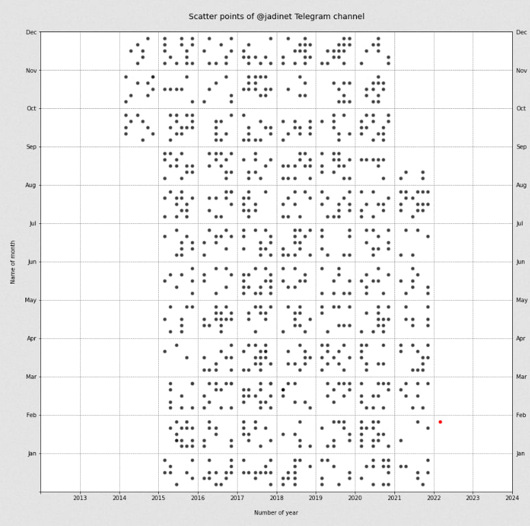

# Telegram Analysis

***Steps:***
1. Go to [Telegram Apps](https://my.telegram.org/auth?to=apps) to get **_api_id_** and **_api_hash_**
2. Install **Telethon** by ```pip install Telethon```
3. Login to your **Telegram** account by [TelegramLogin](https://github.com/mzarchi/telegram/blob/main/TelegramLogin/main.py) and save your [session](https://github.com/mzarchi/telegram/tree/main/sessions)
    > <sub>At this step, you must have **api_id** and **api_hash**</sub>

## Channel Anaysis
<p align="center">

</p>

- [x] Check if data set is exist
    - [x] if exist sort, if not get data
- [x] Get Data
- [x] Save Data
- [x] Draw scatter graph
- [ ] Draw monthly graph