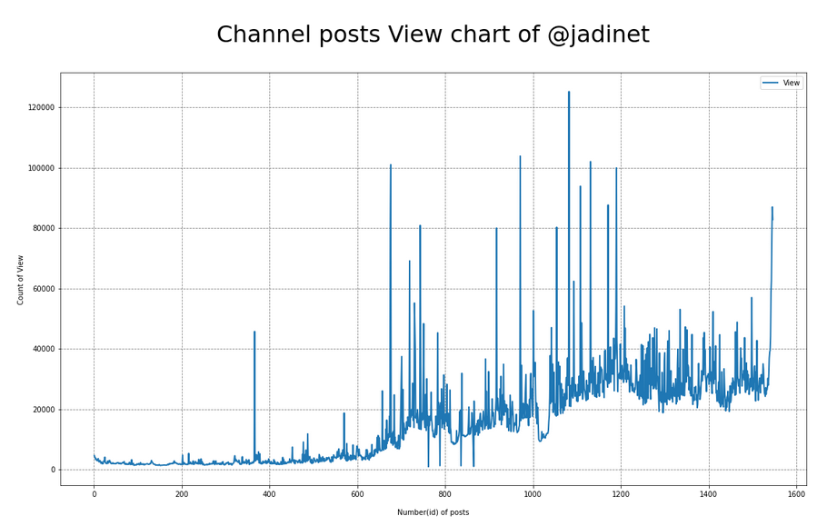
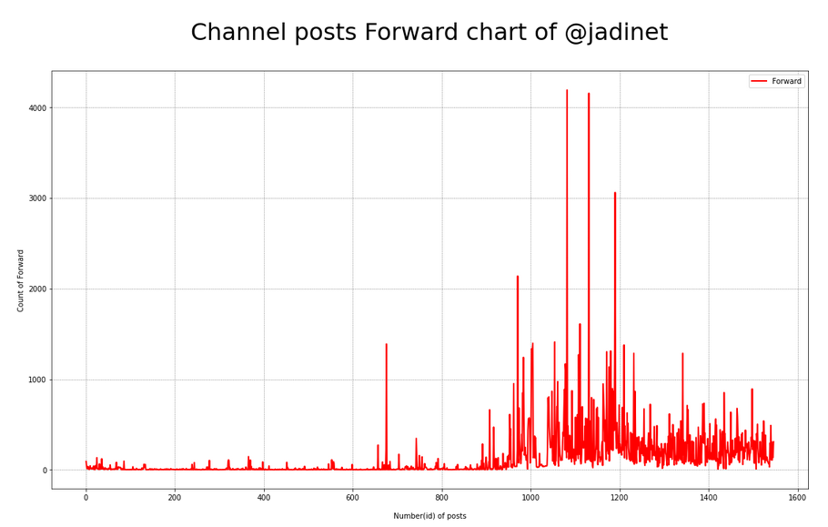

# Telegram Analysis

***Steps:***
1. Go to [Telegram Apps](https://my.telegram.org/auth?to=apps) to get **_api_id_** and **_api_hash_**

2. Install **Telethon** by ```pip install Telethon


3. Use ```git clone https://github.com/mzarchi/telegram.git```

4. Rename ```/config/appconfig_ignore.py``` to ```/config/appconfig.py``` and put your **_api_id_** and **_api_hash_**
    > <sub>At this step, you must have **api_id** and **api_hash**</sub>

5. Login to your **Telegram** account by `` `/login/main.py` ` ` and save your **automatically** your session in ` ``/sessions

6. Open ```/channel/analysis.ipynb``` and run first cell

## Supported params in ```/channel/analysis.ipynb```
The most important cell in this notebook is this:
```
match_case = 6  # Important param
dics = md.get_vfm_data(
    data, match_case,
    min_id=0, max_id=1000,
    min_view=0, max_view=0,
    min_forward=0, max_forward=0,
    min_mention=0, max_mention=0,
    datetime_start=md.ts("2010-01-18 00:00"), datetime_end=md.ts("2010-01-18 00:00"),
)

``` 
According to the following ```match_case```:
```
| 0 : No limit
| 1 : DateTime limit
| 3 : View limit
| 4 : Forward limit
| 5 : Mention limit
| 6 : ID limit
| 13 : DateTime & View limit
| 14 : DateTime & Forward limit
| 15 : DateTime & Mention limit
| 34 : View & Forward limit
| 35 : View & Mention limit
| 45 : Forward & Mention limit
```
You can get the data you want in an edited form!

## Some result of ```/channel/analysis.ipynb```
- Channel posts View chart:
```
plt.plot(dics['cont'], dics['view'], label='View', linewidth=2)
plt.title(
    f'\nChannel posts View chart of @{username}\n', fontname="DejaVu Sans", size=32)
plt.xlabel("\nNumber(id) of posts")
plt.ylabel("Count of View")
plt.legend()
plt.grid(color='gray', linestyle='--', axis='both', linewidth=0.8)
fig = plt.gcf()
fig.set_size_inches(18.5, 10.5)
```
<p align="center">

</p>

- Channel posts Forward chart:
```
plt.plot(dics['cont'], dics['forw'], 'r', label='Forward', linewidth=2)
plt.title(
    f'\nChannel posts Forward chart of @{username}\n', fontname="DejaVu Sans", size=32)
plt.xlabel("\nNumber(id) of posts")
plt.ylabel("Count of Forward")
plt.legend()
plt.grid(color='gray', linestyle='--', axis='both', linewidth=0.5)
fig = plt.gcf()
fig.set_size_inches(18.5, 10.5)
```
<p align="center">

</p>
